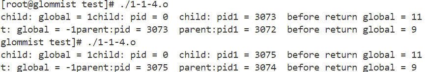

- 1-1-1：
父进程调用fork()函数：返回pid，在父进程中pid为子进程的pid，在子进程中为0

- 1-1-2:
与1-1-1的不同点只有在1-1-2中去掉了wait()一句，意味着父进程不必等待子进程结束后自己再结束：

- 1-1-3：
1-1-3中增加了全局变量global=0并分别在子进程中++操作，在父进程中--操作，可以看到，这两个操作没有互相影响：

- 1-1-4:
在1-1-4中在return前加了对global加10d的操作，可以看到，输出了两个return的修改信息，一个结果为9（父），一个为11（子）.

- 1-1-5_1:system
使用system调用，可以看出是重新创建了一个进程

- 1-1-5_2：exec
使用execl调用，可以看到是爆破了当前的子进程

- 1-2-1:
此实验中，由于两个线程间没有互斥保护，且在两个线程中的加减操作并未原子，所以导致结果出现下图中的不确定性

- 1-2-2：
添加信号量对共享数据的操作进行保护：遇到的问题：最开始不知道sem_t数据类型就是信号量的类型，使用自己定义的int singal作为信号量
初始化出现问题（初始成了0）导致共享信号无法访问，程序不能正常运行。修改使用sem_t以及配套的sem_wait，sem_post后问题得到解决。

- 1-2-3:
在线程中调用system,创建了新的进程。可以看到两个线程属于同一个进程，system调用创造了两个不一样的进程

- 1-2-4：
在线程中调用execl函数，可以看到只进行了一次成功的调用，说明execl爆破了当前进程。

- 1-3：
使用自旋锁：遇到的问题：创建线程时，一开始没有注意lock不是全局变量，没有传lock给pthread_create，正确修改后，得到了正确的结果。
